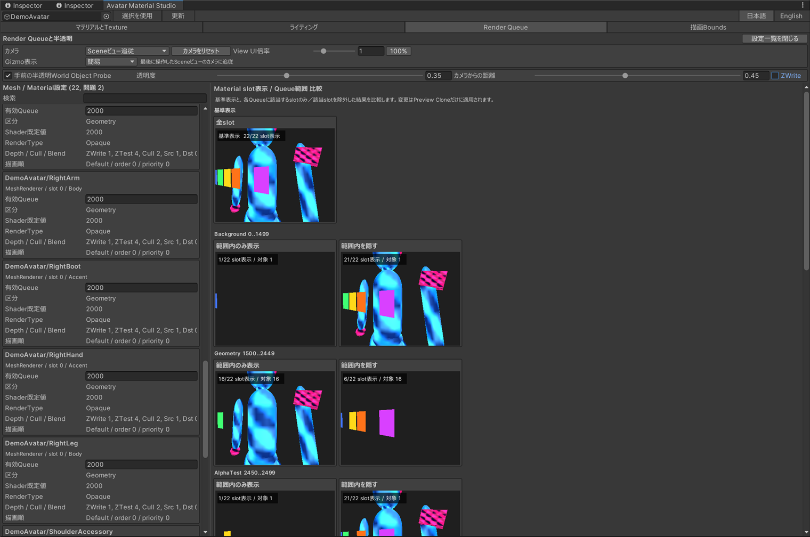

# Avatar Material Studio 使用ガイド

## 起動と対象アバター

`Tools > SabaTools > Avatar Material Studio`を開きます。Hierarchyで`VRCAvatarDescriptor`を持つGameObjectまたはその子を選択し、`選択を使用`を押すとDescriptorのあるルートが対象になります。`更新`はRenderer、Material、Texture、Boundsを再走査します。

Demoを使う場合は、Package ManagerのSamplesから`lilToon Avatar Material Demo`をimportし、`Tools > SabaTools > Open Material Studio Demo`を実行してください。

## 共通Previewパラメータ

| パラメータ | 既定値 | 範囲・選択肢 | 用途 |
| --- | --- | --- | --- |
| カメラ | Sceneビュー追従 | Orbit / Free Fly / Sceneビュー追従 | Previewの視点を選択します。Sceneビュー追従は最後に操作したScene Viewのカメラを使います。 |
| カメラをリセット | - | ボタン | OrbitまたはFree Flyで変更した視点を初期位置へ戻します。 |
| View UI倍率 | 1.0 | 0.75–2.0 | Lighting、Render Queue、Renderer Boundsを含むPreviewカードの幅と高さを一括調整します。 |
| 100% | - | ボタン | View UI倍率を1.0へ戻します。 |
| Gizmo表示 | 簡易 | なし / 簡易 / 詳細 | 補助線を非表示、最小表示、詳細ラベル付き表示から選択します。Lightingの数値ラベルは対象Previewへhoverしたときだけ表示します。 |
| 表示モード | Original | Original / Fallback / Quest | 元Material、VRChat Fallback近似、Quest/Android近似を切り替えます。 |
| 言語 | 日本語 | 日本語 / English | EditorWindow内の表示言語を切り替えます。 |

Orbitは左ドラッグで回転、中ドラッグで平行移動、WheelでZoomします。Free Flyは右ドラッグで視線、中ドラッグで平行移動、Wheelで前後移動します。

## マテリアルとTexture

左側にinactive objectを含む全RendererのMaterial slotをHierarchy path順で表示します。検索はRenderer path、Material、shader、VRChat fallback種別、Quest shader対応状況に利用できます。

Materialを選ぶと、shaderが公開するTexture property、Texture、Tiling、Offset、アバター内の共有slot数を確認・編集できます。`Texture一覧`は使用中Textureを一意に集約し、参照元となるMaterial propertyとRenderer slotを表示します。異なるAsset pathのソース内容が同一の場合はSHA-256比較による重複候補として表示されます。

Material slot、Texture、Tiling、Offsetの変更はSceneまたはMaterial assetへ書き込まれます。共有Materialを変更するとアバター外の参照元にも反映されるため、`Uses in avatar`とAsset pathを確認してください。変更はUnity Undoへ記録されます。

## ライティング

17種類の照明条件をグリッドで比較します。

| 分類 | シナリオ |
| --- | --- |
| 基準 | 無照明、環境光最小、環境光最大 |
| Directional | 最小、標準、最大、暖色、寒色、2灯、2色、逆光 |
| Point | 近距離、遠距離、2灯、上方、下方 |
| 混合 | Directional + Point |

Directional Lightは光の進行ベクトルを矢印で示します。Point Lightは照射元の位置と、照射元からアバターへ向かう方向を示します。`Gizmo表示`が`簡易`の場合は線と記号だけを表示し、`詳細`ではhover中のPreviewにLight種別、方向または位置、Intensityを追加表示します。

照明表示はshaderの比較を補助するPreviewであり、VRChat clientの照明環境を再現するものではありません。

## Render Queueと半透明

左側の`Mesh / Material設定`は、各slotの有効Queue、shader既定Queue、RenderType、ZWrite、ZTest、Cull、Blend、sorting layer/order、renderer priorityを表示します。RenderTypeとQueueの不整合、範囲外Queue、半透明MaterialのZWriteなどは警告として表示されます。

右側では基準表示に加え、標準Queue範囲ごとに次の2結果を並べます。

- `範囲内のみ表示`: 該当QueueのMaterial slotだけを表示
- `範囲内を隠す`: 該当QueueのMaterial slotだけを非表示

Renderer単位ではなくMaterial slot/submesh単位で切り替えるため、複数Materialを持つ衣装でも、対象外slotまで消して比較結果を誤ることを避けられます。変更はPreview cloneだけへ適用されます。

| 区分 | Queue範囲 |
| --- | --- |
| Background | 0–1499 |
| Geometry | 1500–2449 |
| AlphaTest | 2450–2499 |
| GeometryLast | 2500 |
| Transparent | 2501–3999 |
| Overlay | 4000–5000 |

`手前の半透明World Object Probe`は、アバターとカメラの間に半透明面を置いてQueue 2501、3000、3100、4000を比較します。

| パラメータ | 既定値 | 範囲 | 用途 |
| --- | --- | --- | --- |
| 有効 | On | On / Off | 半透明Probeの表示を切り替えます。 |
| 透明度 | 0.35 | 0.05–0.95 | Probe Materialのalphaを設定します。 |
| カメラからの距離 | 0.45 | 0.1–0.9 | カメラとアバターの間でProbe位置を調整します。 |
| ZWrite | Off | On / Off | 深度書き込みによる半透明sorting差を比較します。 |

`有効Queue`の編集は対象Material assetへ書き込まれ、Unity Undoへ記録されます。`-1`はshader既定値、明示値は0–5000へ制限されます。

## Renderer Bounds

MeshRendererとSkinnedMeshRendererのlocal/world bounds、wireframe overlay、ViewPositionを注視する48個のFrustum probeを確認します。16方向それぞれに近・中・遠の3距離を評価し、色で結果を示します。

- 緑: 全Renderer BoundsがFrustum内
- 橙: 一部または選択RendererがFrustum外
- 赤: 全Renderer BoundsがFrustum外

方向0–7は水平45度刻み、8–11は上方斜め、12–15は下方斜めです。方向を選ぶと近・中・遠の固定Preview、ユーザー操作Camera、上面・側面の位置関係図を同時に確認できます。

| パラメータ | 既定値 | 範囲 | 用途 |
| --- | --- | --- | --- |
| 近距離 | 0.35 m | 0.01 m以上 | Near probeとViewPositionの距離です。 |
| 中距離 | 2 m | 0.01 m以上 | Middle probeとViewPositionの距離です。 |
| 遠距離 | 10 m | 0.01 m以上 | Far probeとViewPositionの距離です。 |
| FOV | 60° | 20–120° | Probe cameraの垂直画角です。 |
| 全Boundsを表示 | On | On / Off | 選択Rendererだけでなく全Rendererのoverlayを表示します。 |

UnityのAABB Frustum判定は保守的です。警告色だけで判断せず、固定Previewと実機表示を確認してください。

## Previewの制約

Fallback modeはMaterialの`VRCFallback` tagを優先し、tagがない場合は公開されているshader名・property・keyword規則から組み込みshaderを選ぶ近似表示です。最終確認はVRChatのAction Menuにある`Options > Avatar > Fallback Shaders`で行ってください。

Quest modeはAndroid Per-Platform Overrideがあればそのavatarを使用し、許可済み`VRChat/Mobile` shaderは維持します。それ以外は利用可能なMobile shaderへproperty名ベースで近似変換します。Android build、SDK validation、透明表現、custom shader固有property、shader pass、platform import settingsは再現しません。SDK Control PanelのAndroid validationと実機のBuild & Testを最終確認に使用してください。

参照した一次情報（2026-08-30確認）：

- [Shader Blocking and Fallback System](https://creators.vrchat.com/avatars/shader-fallback-system/)
- [Android Content Limitations](https://creators.vrchat.com/platforms/android/quest-content-limitations/)
- [Per-Platform Avatar Overrides](https://creators.vrchat.com/avatars/per-platform-avatar-overrides/)
