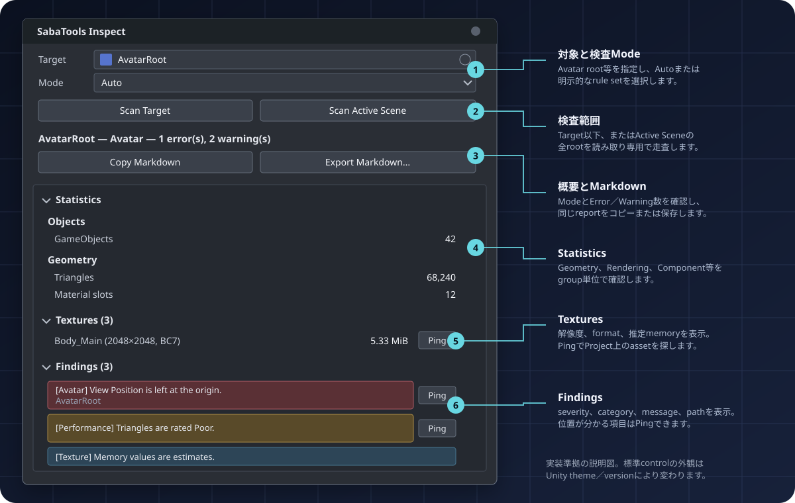

# SabaTools Inspect Core

VRChat のアバター・ワールド編集向けの**非破壊**検査ツールの基盤パッケージです。対象の階層を走査して統計と問題点を一覧表示します。シーンには一切変更を加えません。

VRChat SDK に依存しないため、アバター用・ワールド用どちらのプロジェクトにも、SDK が無いプロジェクトにも導入できます。

## 機能

- **統計**: GameObject 数、三角形数、Mesh / Skinned Mesh Renderer 数、ユニークボーン数、マテリアルスロット・ユニークマテリアル・シェーダー数、テクスチャ数と GPU メモリ推定、PhysBone / Contact / Constraint 数、Particle System・Light・Audio Source 等のコンポーネント数
- **Missing 参照の検出**: Missing script、Prefab アセット欠落、メッシュ未割り当て、null ボーンスロット、空マテリアルスロット、Inspector で "Missing" と表示されるシリアライズ参照。各項目は Ping ボタンで該当オブジェクトへ移動できます
- **チェックリスト**: アバターは VRChat の PC パフォーマンスランク (参考値) に対する評価、ワールドはリアルタイムライト等の一般的な注意点
- **Markdown 書き出し**: レポートをクリップボードへコピー、またはファイルへ保存

## SDK 固有の検査を足す

このパッケージは VRChat SDK の型を参照しません。SDK の型で初めて分かること (Expression Parameters のビット数、Spawn の妥当性など) は、プロジェクトに合わせて次のどちらかを追加してください。

| 追加するパッケージ | 対象 | 依存する SDK |
| --- | --- | --- |
| `io.github.sabas0ba.sabatools.avatar` | アバタープロジェクト | `com.vrchat.avatars` |
| `io.github.sabas0ba.sabatools.world` | ワールドプロジェクト | `com.vrchat.worlds` |

両方を入れる必要はありません。VRChat の Avatars SDK と Worlds SDK は同一プロジェクトでの併用が想定されていないため、パッケージを分けてあります。

Material／Texture の編集と Fallback／Quest 表示比較は、書き込み可能であることを Inspect から分離した `io.github.sabas0ba.sabatools.avatar-materials` を使用してください。このパッケージは core へ依存せず、Inspect の非破壊性を変更しません。

## 使い方

1. `Tools > SabaTools > Inspect Window` を開く
2. Target にアバターやワールドのルートを指定して **Scan Target**、またはシーン全体を **Scan Active Scene**
3. Mode は既定の Auto です。導入済みのモジュールが対象を認識すればそれに従い、いなければ `VRCAvatarDescriptor` / `VRCSceneDescriptor` の型名から判定します。どちらも無ければ Generic (統計と参照チェックのみ) になります

Hierarchy でオブジェクトを選択して `Tools > SabaTools > Inspect Selection` でも起動できます。



各control、Mode、表示項目、Avatar／World別の操作例は[UI操作ガイド](Documentation~/UI.md)を
参照してください。

## 判定の根拠と限界

- テクスチャの GPU メモリはフォーマットの bpp とミップ係数 4/3 による**推定値**です。Unity の実測とは差が出ます。未知のフォーマットは 32 bpp として扱い、その旨を Findings に出します
- パフォーマンスランクのしきい値は 2026-08 時点の [VRChat 公式ドキュメント](https://creators.vrchat.com/avatars/avatar-performance-ranking-system/) に基づく参考値です。VRChat 側で改定されうるものであり、本パッケージの CI は追随を検証していません。正式な判定は SDK と公式ドキュメントを参照してください
- SDK コンポーネントの数え上げは型名一致です。モジュールが入っていれば、そちらが実際の型で読んだ結果を上書きせず補足します

## 自分のツールから呼ぶ

```csharp
using SabaTools.Inspect;
using SabaTools.Inspect.Editors;

InspectionReport report = InspectApi.Inspect(avatarRoot, InspectMode.Avatar);
if (report.ErrorCount > 0) { Debug.LogError(report.ToMarkdown()); }
```

検査を追加する場合は `InspectionModule` を継承します。`TypeCache` で自動的に見つかるため、登録は不要です。

## 動作環境

Unity 2022.3 (VRChat 推奨バージョン準拠)。Editor 専用アセンブリのみで構成され、ビルド成果物には何も含まれません。

## ライセンス

本パッケージは Apache License 2.0 で提供します。全文は [LICENSE.md](LICENSE.md) を参照してください。外部依存・モデル・素材には、それぞれの配布元のライセンスが適用されます。
